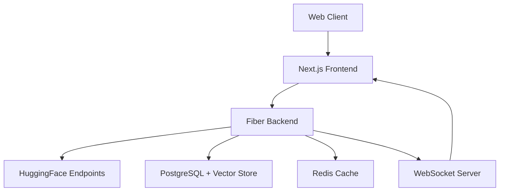

# VoiceScribe Pro - AI-Powered Meeting Intelligence Platform

## What It Does
VoiceScribe Pro transforms how professionals handle meeting documentation and follow-ups by creating an intelligent meeting assistant that processes real-time audio, generates actionable insights, and maintains a searchable knowledge base of organizational meetings.

## Real-World Problem
Organizations lose valuable information and context from meetings due to incomplete documentation, missed action items, and difficulty searching through historical meeting content. Manual note-taking distracts from active participation, and important details often fall through the cracks.

## Key HuggingFace Tasks Used
- **Audio-Text-to-Text** (for real-time transcription)
- **Summarization** (for meeting highlights)
- **Text Classification** (for topic/category tagging)
- **Text Ranking** (for identifying key action items)
- **Question Answering** (for knowledge base queries)

## Tech Stack
**Frontend:**
- Next.js 15 with Server Components
- TailwindCSS
- WebSocket for real-time features

**Backend:**
- Fiber (Go)
- PostgreSQL 
- Redis 
- Docker

**ML Infrastructure:**
- HuggingFace Inference Endpoints
- OpenAI Whisper (backup ASR)
- Vector embeddings for search

**Cloud:**
- AWS ECS/EKS
- S3 for audio storage
- ElasticCache for Redis

## Key Features
- Real-time transcription with speaker diarization
- Automated action item extraction and assignment
- Semantic search across all meeting content
- Meeting analytics dashboard
- Integration with calendar and task management tools
- Custom knowledge base training on company terminology

## Technical Challenges to Highlight
- Real-time audio processing and transcription pipeline
- Efficient vector search implementation 
- Scalable WebSocket architecture for live features
- Complex state management for real-time UI updates
- Custom fine-tuning of language models for company-specific terminology


## Deployment Architecture


## Running the Project

### Backend (Fiber + Go)
- **Main Tech:** [Fiber (Go)](https://gofiber.io/), PostgreSQL, Redis, Docker
- **Requirements:** Docker, Docker Compose, Go (for local dev)
  - **Environment Variables:** Ensure the following are set or provided via a `.env` file:
    - `CLERK_SECRET_KEY`
    - `DATABASE_URL`
    - `REDIS_URL`

#### Using Makefile (Recommended)
- **Build Docker image:**
  ```sh
  make build
  ```
- **Run in Docker:**
  ```sh
  make run
  ```
- **Development mode (with Docker Compose):**
  ```sh
  make dev
  ```
- **Clean up containers/images:**
  ```sh
  make clean
  ```
  **Note:**  
This project's Dockerfile uses advanced cache mounts (`--mount=type=cache`), which require [Docker BuildKit](https://docs.docker.com/build/buildkit/).  
Make sure BuildKit is enabled when building images:

```sh
DOCKER_BUILDKIT=1 docker build -t voicescribe-pro .
```

Or, for all Docker builds, you can export:

```sh
export DOCKER_BUILDKIT=1
```

If you use the provided `Makefile`, BuildKit will be required for the `make build` and `make dev` commands.

### Frontend (Next.js 15 + TailwindCSS)
- **Main Tech:** [Next.js 15](https://nextjs.org/), React 19, TailwindCSS 4, Clerk Auth, Shadcn UI
- **Requirements:** Node.js (v20+), Yarn or npm

#### Local Development
1. Navigate to the frontend directory:
   ```sh
   cd web
   ```
2. Install dependencies:
   ```sh
   npm install
   # or
   yarn
   ```
3. Start the development server:
   ```sh
   npm run dev
   # or
   yarn dev
   ```

#### Production Build
```sh
npm run build && npm start
# or
yarn build && yarn start
```


---

